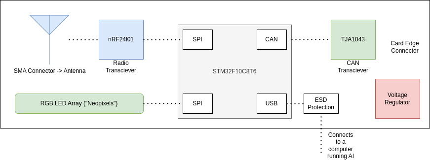

# the-bots-mainboard
The main board for the the bots SSL robocup team. The main goal is to act as a radio to CAN bridge if flashed as a robot, and a radio to USB bridge if flashed as a dongle and plugged into the computer running AI.

